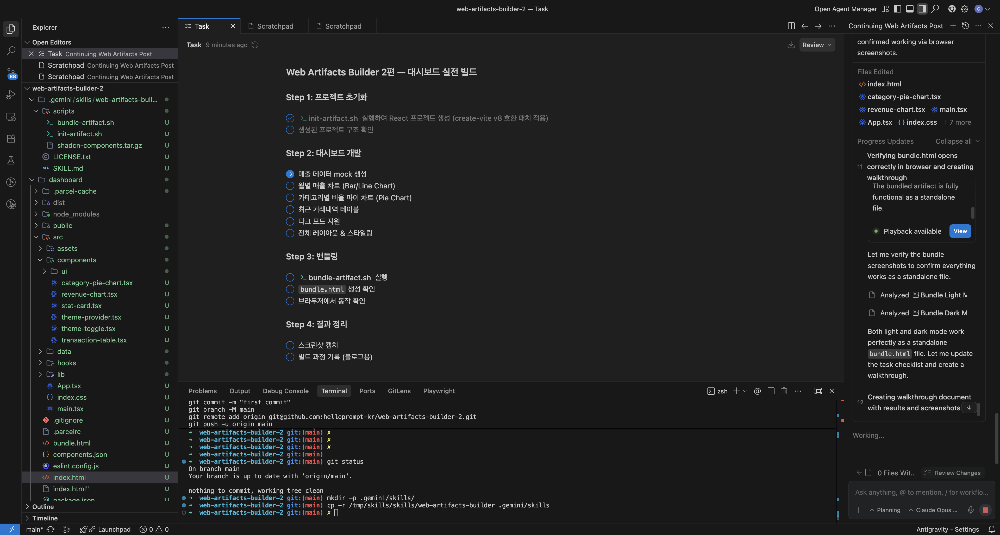
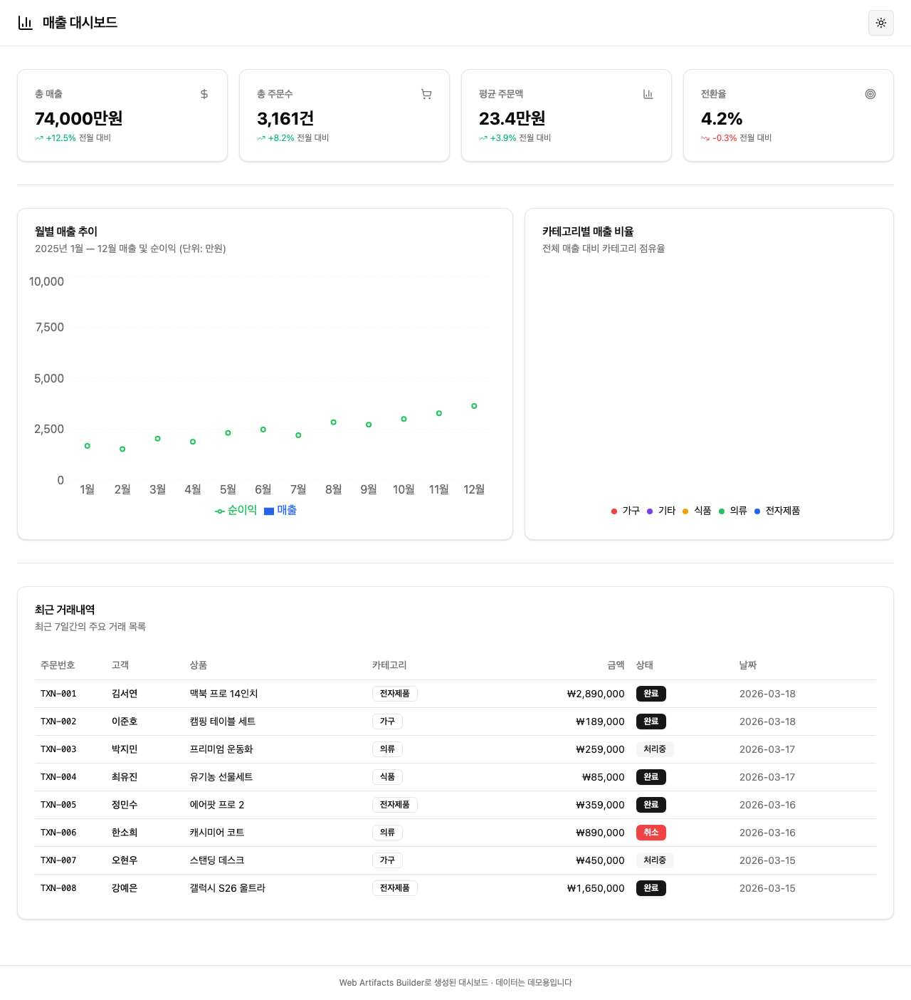
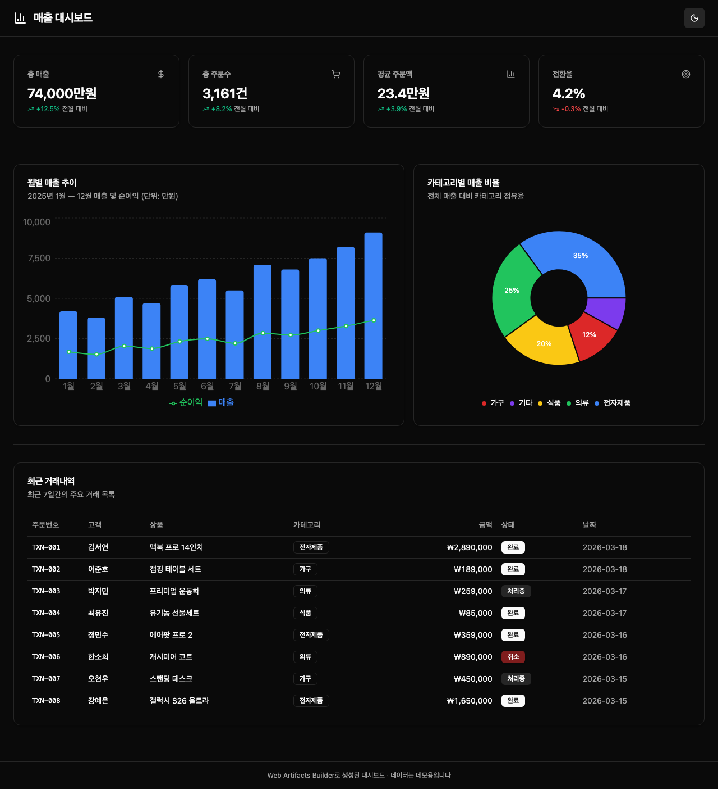

# 🚀 Web Artifacts Builder — 프롬프트 한 줄로 만든 대시보드

> **사람이 한 일: 프롬프트 1줄. AI가 한 일: 나머지 전부.**

이 프로젝트는 [Anthropic의 Web Artifacts Builder](https://github.com/anthropics/skills/tree/main/skills/web-artifacts-builder) 스킬을 사용하여, **단 한 줄의 프롬프트로 매출 대시보드 웹앱을 완성한 실험 기록**입니다.

---

## ⚡ 내가 한 것은 이것뿐이다

### 1. 스킬 설치 (30초)

```bash
git clone https://github.com/anthropics/skills.git /tmp/skills
mkdir -p .gemini/skills
cp -r /tmp/skills/skills/web-artifacts-builder .gemini/skills/
```

### 2. AI에게 명령 (1줄)

```
매출 데이터를 보여주는 대시보드 웹앱을 만들어줘.
월별 매출 차트, 카테고리별 비율 파이 차트, 최근 거래내역 테이블이 있으면 좋겠어.
다크 모드도 지원해줘.
```

**끝.** 나머지는 전부 AI가 알아서 했다.

---

## 🖥️ 개발 환경

**Antigravity** (Gemini 기반 AI 코딩 에이전트)로 개발했다. VS Code 위에서 AI가 터미널 명령어, 파일 생성, 브라우저 테스트까지 자율적으로 수행한다.



---

## 🤖 AI가 자동으로 수행한 작업

아래 과정에서 사람이 추가로 개입한 것은 **없다.**

### Step 1: 프로젝트 초기화

```bash
bash .gemini/skills/web-artifacts-builder/scripts/init-artifact.sh dashboard
```

AI가 `init-artifact.sh` 스크립트를 실행하여 React 프로젝트를 자동 생성했다:

- ✅ React 19 + TypeScript (via Vite 8)
- ✅ Tailwind CSS 3.4.1 + shadcn/ui 테마 시스템
- ✅ 40개 이상의 shadcn/ui 컴포넌트 사전 설치
- ✅ 전체 Radix UI 의존성 포함
- ✅ Parcel 번들링 설정

> ⚠️ **발견된 이슈:** `create-vite` v8이 interactive prompt에서 자동으로 dev 서버를 실행하여 스크립트가 블로킹됨. AI가 `echo n |` 파이프로 자동 해결.

### Step 2: 대시보드 개발

AI가 프롬프트를 분석하고, 다음 컴포넌트를 **자동 설계 및 구현**했다:

| 파일 | 역할 |
|------|------|
| `src/data/mock-data.ts` | 월별 매출·카테고리·거래 내역 데모 데이터 |
| `src/components/stat-card.tsx` | 총 매출, 주문수, 평균 주문액, 전환율 카드 (4개) |
| `src/components/revenue-chart.tsx` | 월별 매출 Bar + 순이익 Line 복합 차트 |
| `src/components/category-pie-chart.tsx` | 카테고리별 도넛 차트 |
| `src/components/transaction-table.tsx` | 최근 거래내역 테이블 (shadcn Table + Badge) |
| `src/components/theme-provider.tsx` | 라이트/다크 모드 상태 관리 |
| `src/components/theme-toggle.tsx` | 테마 전환 버튼 (☀️/🌙) |
| `src/App.tsx` | 전체 레이아웃 조합 |

추가로 `recharts` 라이브러리를 자동 설치하고, CSS에 차트 전용 색상 변수를 추가했다.

### Step 3: 브라우저 검증

AI가 브라우저를 자동으로 열어 **라이트 모드와 다크 모드 모두 스크린샷을 캡처하고 검증**했다:

<table>
<tr>
<td><strong>☀️ 라이트 모드</strong></td>
<td><strong>🌙 다크 모드</strong></td>
</tr>
<tr>
<td></td>
<td></td>
</tr>
</table>

### Step 4: 번들링

```bash
bash .gemini/skills/web-artifacts-builder/scripts/bundle-artifact.sh
```

55개 소스 파일을 **`bundle.html` 단일 파일 (808KB)**로 패키징. 더블클릭하면 브라우저에서 바로 열린다. 서버 불필요.

> ⚠️ **발견된 이슈:** `create-vite` v8 템플릿이 파비콘 파일명을 `vite.svg`에서 `favicon.svg`로 변경하여, 번들링 시 파일 참조 에러 발생. AI가 `index.html`에서 해당 라인을 자동 제거하여 해결.

### Step 5: 번들 파일 검증

AI가 `bundle.html`을 브라우저에서 직접 열어 standalone 동작을 확인했다:

- ✅ 스탯 카드 4개 렌더링
- ✅ 월별 매출 차트 (Bar + Line)
- ✅ 카테고리별 파이 차트 (도넛)
- ✅ 거래내역 테이블 (8건)
- ✅ 다크 모드 전환 정상 작동
- ✅ 인터넷 연결 없이 로컬에서 동작

---

## 📊 결과 요약

| 항목 | 값 |
|------|-----|
| **사람이 쓴 프롬프트** | 1줄 (64자) |
| **AI가 생성한 파일** | 55개 |
| **사용된 기술 스택** | React 19, TypeScript, Vite 8, Tailwind 3.4.1, shadcn/ui, Recharts 3.8 |
| **번들 결과** | `bundle.html` 808KB (단일 파일) |
| **다크 모드** | ✅ 지원 |
| **서버 필요 여부** | ❌ 불필요 (더블클릭으로 실행) |
| **AI가 자동 해결한 이슈** | 2건 (create-vite v8 호환, favicon 참조) |

---

## 🛠️ 직접 실행하기

### 사전 요구사항

- Node.js 18+
- pnpm

### 개발 서버 실행

```bash
cd dashboard
pnpm install
pnpm dev
# → http://localhost:5173/
```

### 번들 파일 바로 열기

```bash
open dashboard/bundle.html
# 또는 파일을 더블클릭
```

---

## 📂 프로젝트 구조

```
web-artifacts-builder-2/
├── .gemini/skills/web-artifacts-builder/   # 스킬 파일 (Anthropic 공식)
│   ├── SKILL.md                            # AI에게 주는 작업 설명서
│   └── scripts/
│       ├── init-artifact.sh                # 프로젝트 자동 생성
│       ├── bundle-artifact.sh              # 단일 HTML 번들링
│       └── shadcn-components.tar.gz        # 40+ UI 부품
├── dashboard/                              # AI가 생성한 프로젝트
│   ├── src/
│   │   ├── components/                     # 대시보드 컴포넌트 7개
│   │   ├── data/                           # 데모 데이터
│   │   ├── App.tsx                         # 메인 레이아웃
│   │   └── main.tsx                        # 엔트리포인트
│   ├── bundle.html                         # ⭐ 최종 결과물 (808KB)
│   └── package.json
├── docs/                                   # 스크린샷
└── screenshot.png                          # 개발 환경 캡처
```

---

## 📎 관련 링크

- [Web Artifacts Builder (공식 저장소)](https://github.com/anthropics/skills/tree/main/skills/web-artifacts-builder) — 스킬 원본
- [shadcn/ui 컴포넌트](https://ui.shadcn.com/docs/components) — 탑재된 40+ UI 부품 목록
- [Anthropic Skills Repository](https://github.com/anthropics/skills) — 전체 스킬 모음

---

*이 프로젝트는 [helloprompt.kr](https://helloprompt.kr)의 "Web Artifacts Builder 리뷰" 시리즈 2편을 위해 제작되었습니다.*
* [AI가 만든 대시보드, 직접 돌려봤다](https://helloprompt.kr/posts/2026/03/webapp-skill-2)
